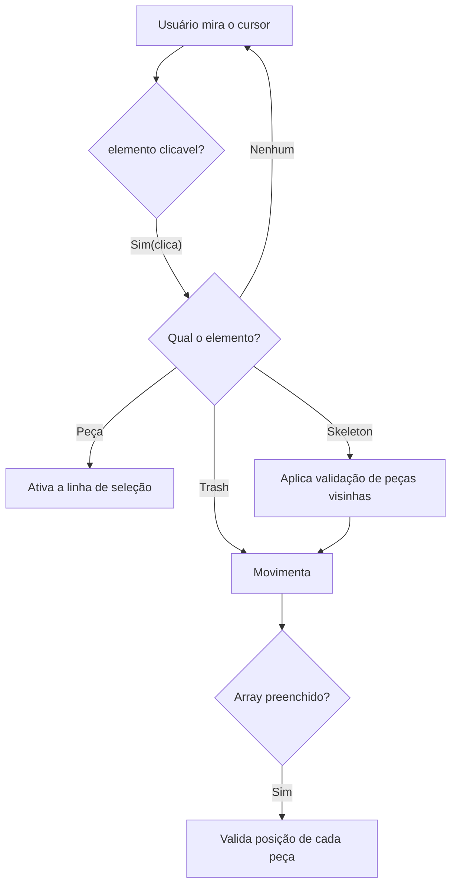
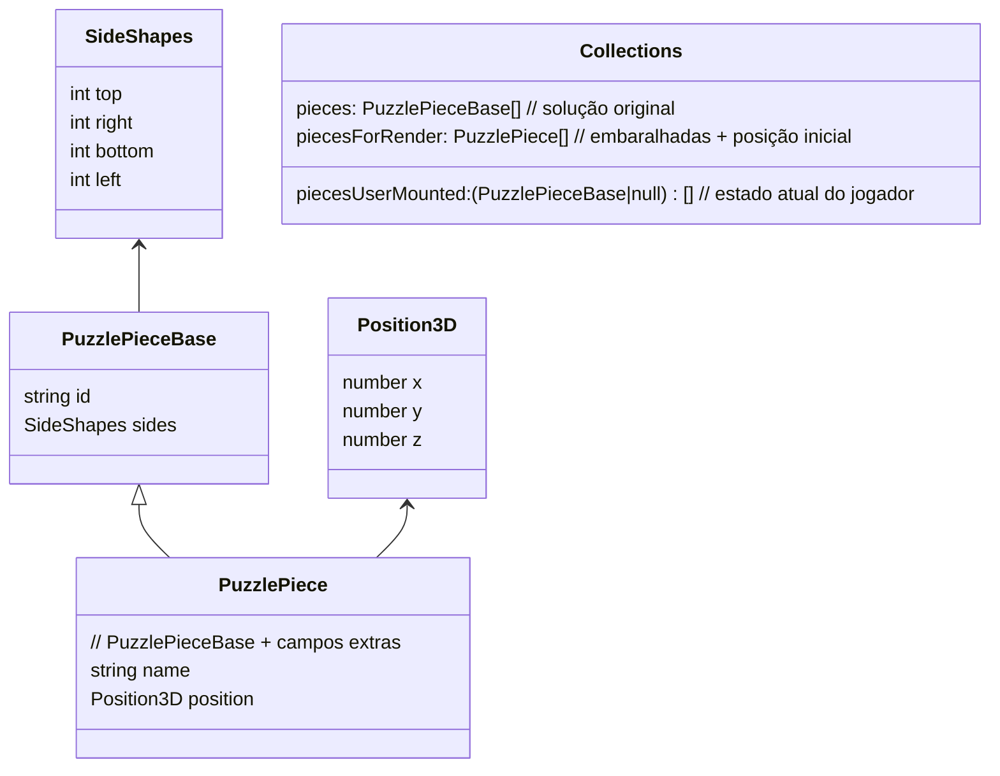
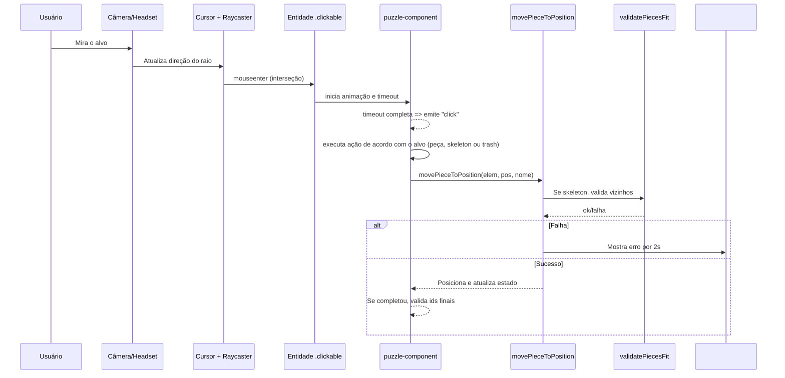

## Quebra‑cabeça 3D em RA/VR com A‑Frame + Three.js

Projeto de um quebra‑cabeça 3D interativo em realidade aumentada/virtual (A‑Frame) que gera peças com lados que se encaixam, embaralha, permite selecionar e mover as peças, valida encaixes e verifica a conclusão do jogo.

Arquivos principais:
- `index.html`: cena A‑Frame, câmera, cursor e HUD de erro.
- `script.js`: toda a lógica do jogo (geração, render, interação, validações). Documentado com JSDoc para facilitar leitura/manutenção.
- `subprojects/`: pequenos projetos de referência usados para isolar e testar conceitos:
	- `subprojects/puzzle-piece/`: demonstração da geração de peças via parâmetros (Three.js + ExtrudeGeometry).
	- `subprojects/select-line/`: demonstração de seleção com linha e raycasting (cursor com fuse/timeout e ligação visual).

## Como executar

1) Basta abrir o `index.html` no navegador (recomendado: Chrome/Edge). Não há build nem dependências locais, pois A‑Frame é carregado por CDN.
2) Use o mouse para mirar o cursor (anel) nos elementos. A seleção usa um tempo de foco (timeout) para disparar o “click”.
3) Selecione uma peça e depois um ponto do esqueleto (as esferas vermelhas) para movê‑la. Se o encaixe com vizinhos for inválido, um aviso vermelho aparece por 2 segundos.

## Visão geral do funcionamento

O jogo cria um tabuleiro N×N (configurável) e gera N² peças com lados compatíveis. As peças são embaralhadas e renderizadas espalhadas. O usuário seleciona uma peça (origem) e depois um alvo (um ponto do esqueleto ou área de descarte). A lógica valida o encaixe com as peças vizinhas; se for válido, a peça é posicionada. Quando todas as posições forem ocupadas, é feita uma validação final da solução.

### Geração das peças (script.js → `generatePieces`)

- Tamanho do quebra‑cabeça: `puzzleSize` (por padrão 4, logo 4×4=16 peças).
- Para cada posição (linha, coluna), gera um objeto com `id` único (`crypto.randomUUID()`) e `sides` contendo 4 lados: `top`, `right`, `bottom`, `left`.
- Bordas do tabuleiro recebem lado reto (`0`). Lados internos são definidos para manter compatibilidade entre peças adjacentes:
	- Para o topo/direita, quando não são borda, escolhe aleatoriamente `1` (reentrante/para dentro) ou `2` (saliente/para fora).
	- Para baixo/esquerda, herda o oposto do vizinho já criado (ex.: se o vizinho superior tem `top = 1`, então o `bottom` atual vira `2`).

Isso garante que, na solução correta, lados adjacentes se complementem (1↔2; 0 nas bordas).

### Embaralhamento e posicionamento inicial (script.js → `definePiecePositions`)

- Embaralha as peças com Fisher‑Yates (`embaralharArray`).
- Atribui um `name` (`piece-<n>`) e uma `position` inicial para cada peça, usando offsets (`widthInitGlobal`, `heightInitGlobal`, `zOffset`) e pequenas variações em X por coluna para espalhar.
- Resultado é `piecesForRender`, usado na renderização.

### Renderização (script.js → `renderPieces`, `mountPuzzlePiece`, `mountPuzzleSkeleton`)

- `mountPuzzlePiece` cria um `a-entity` com componente `puzzle-piece` (A‑Frame) que constrói a geometria através do Three.js (ver “Geração de geometria” abaixo).
- `mountPuzzleSkeleton` cria esferas (`a-sphere`) como guias de posicionamento, uma por célula do tabuleiro (`skeleton-1`, `skeleton-2`, ...). Também cria uma “lixeira” translúcida e pontos extras “trash‑<n>” logo acima como área de descarte/estacionamento.

### Seleção e captura das posições (raycasting + cursor) (script.js → componentes `puzzle-component` e `cursor-ring`)

- O cursor é um anel (`#cursor`) na frente da câmera com `raycaster="objects: .clickable"`. Ele identifica intersecções com elementos clicáveis.
- Para UX em VR/AR (gaze), o projeto simula um “fuse” via timeout no `mouseenter`: após manter o cursor focado por um período, o `click` é disparado automaticamente.
- `cursor-ring` atualiza uma “linha de seleção” dinâmica entre a peça selecionada e a posição atual do cursor, chamando `lineSelection.setEnd(...)` a cada frame (tick).
- Ao clicar em:
	- uma PEÇA: marca o início da seleção (`lineSelection.setStart(...)`) e guarda o elemento selecionado.
	- um ESQUELETO/LIXEIRA: finaliza a seleção e tenta mover a peça selecionada para a posição do alvo.

### Movimento das peças (script.js → `movePieceToPosition`)

- Recebe a peça A‑Frame selecionada, a posição do alvo e o nome do alvo (`skeleton-<n>` ou `trash-<n>`).
- Quando o alvo é um `skeleton-<n>`:
	- Calcula o índice no array de montagem (`piecesUserMounted`), acessa possíveis vizinhos (cima/baixo/esquerda/direita) por aritmética de índices (`±1`, `±puzzleSize`).
	- Valida encaixes com cada vizinho usando `validatePiecesFit` (detalhes abaixo).
	- Se qualquer validação falhar, mostra o painel de erro (`#error`) por 2s e cancela o movimento.
	- Se tudo ok, registra a peça naquela posição do array.
- Em seguida, aplica o offset de meia peça/telha para alinhar o mesh 3D com o centro do alvo.

### Validação de encaixe entre peças (script.js → `validatePiecesFit`)

- Regras básicas de compatibilidade de lados:
	- Complementares: `1` (reentrante) ↔ `2` (saliente).
	- Bordas retas: `0` ↔ `0` (borda com borda) e `0` com `1` ou `1` com `0` (flexibilização para quinas/bordas — ver lógica do seu jogo).
	- O código também aceita `1` com `1` em casos específicos (permite tolerância conforme seu design atual).
- Essa função é usada antes de fixar a peça na célula do esqueleto.

### Validação final do game (script.js → ao final de `movePieceToPosition`)

- Quando `piecesUserMounted` não contém mais `null`, o jogo verifica se a solução está correta.
- A validação compara, posição por posição, se o `id` da peça montada bate com o `id` da peça original (não embaralhada) em `pieces`.
- Se todos os `id`s coincidirem, o puzzle foi concluído corretamente; caso contrário, é exibida a mensagem de puzzle incorreto.

## Lógica de criação das peças (topologia dos lados)

Cada lado da peça tem um tipo:
- `0`: reto (bordas externas do tabuleiro)
- `1`: reentrante (para dentro)
- `2`: saliente (para fora)

Ao gerar a grade, a peça “espelha” o lado do vizinho já existente para garantir compatibilidade:
- Se o vizinho superior tem `top = 1`, então o `bottom` da peça atual vira `2` (e vice‑versa).
- Para a esquerda, `left` da atual é o oposto do `right` do vizinho esquerdo.

Assim, a solução correta sempre existe por construção, e o desafio está em rearranjar as peças embaralhadas.

## Tópicos avançados

### Geração de geometria com Three.js (script.js → `createShape`)

- A geometria de cada peça é construída com `THREE.Shape` traçando o contorno em 2D.
- Para cada lado:
	- Lado reto (`0`): linhas retas.
	- Lados `1`/`2`: curvas de encaixe via `bezierCurveTo` (reentrante vs. saliente) com pontos de controle calculados proporcionalmente a `pieceSize`.
- O shape 2D é extrudado com `THREE.ExtrudeGeometry` usando `depth = pieceDepth`, sem chanfrado (`bevelEnabled: false`).
- O material padrão usa `THREE.MeshStandardMaterial` (sombreamento físico simples), com `castShadow` e `receiveShadow` habilitados.

Referência prática:
- Em `subprojects/puzzle-piece/`, o componente `cubo-peca` aceita os lados como parâmetros (`top`, `left`, `bottom`, `right`) e gera a mesma lógica de curvas/retas — útil para testar rapidamente formatos diferentes:
	- Ex.: `cubo-peca="top:1;left:2;bottom:0;right:2"`.

### Identificação de lados e peças vizinhas

- Cada peça conhece seus lados (`top/right/bottom/left`).
- Para validar encaixe ao posicionar, o código localiza vizinhos no array 1D `piecesUserMounted` a partir do índice do alvo:
	- Topo: `index + puzzleSize`
	- Baixo: `index - puzzleSize`
	- Esquerda: `index - 1`
	- Direita: `index + 1`
- Em seguida compara os lados opostos com `validatePiecesFit`.

### Raycasting, cursor e linha de seleção (por que implementar)

- O A‑Frame fornece `raycaster` e `cursor` para selecionar entidades `.clickable` ao mirar com a câmera.
- Em contextos VR/AR (sem mouse), é comum usar “gaze selection”: manter o olhar por um tempo para confirmar. No projeto principal, isso é simulado com `mouseenter` + timeout (e uma animação que “preenche” o anel), disparando `click` automaticamente.
- A “linha de seleção” mostra visualmente a conexão entre a peça selecionada e o alvo atual do cursor, ajudando o jogador a entender o fluxo “selecionar origem → selecionar destino”.

Referência prática:
- `subprojects/select-line/` mostra uma versão mínima dessa interação: dois cubos clicáveis, um `raycaster` e a linha que liga origem e destino.

## Principais parâmetros e constantes (em `script.js`)

- `puzzleSize`: tamanho do tabuleiro (N×N).
- `pieceSize` e `pieceDepth`: dimensões de cada peça.
- `zOffset`, `heightInitGlobal`, `widthInitGlobal`: definem a “camada” Z, altura e largura iniciais das peças.
- `pieces`, `piecesForRender`, `piecesUserMounted`: coleções que representam, respectivamente, a solução original, as peças embaralhadas/posicionadas para renderização e o estado atual montado pelo usuário.

## Subprojects (referências úteis)

- `subprojects/puzzle-piece/`
	- Mostra a criação de peças passando lados por parâmetro (`cubo-peca`).
	- Bom para entender na prática como curvas são geradas em cada lado e como o `ExtrudeGeometry` forma o volume.

- `subprojects/select-line/`
	- Demonstra a mecânica de seleção com linha entre entidades clicáveis usando `raycaster`.
	- Justifica o uso de uma linha/feedback visual para guiar a interação de “selecionar e soltar” no espaço 3D.

## Diagramas (para ajudar na explicação de fluxos)

### 1) Fluxo de seleção, movimento e validações

### 2) Estruturas de dados e tipos principais

### 4) Sequência de eventos com raycasting e click

